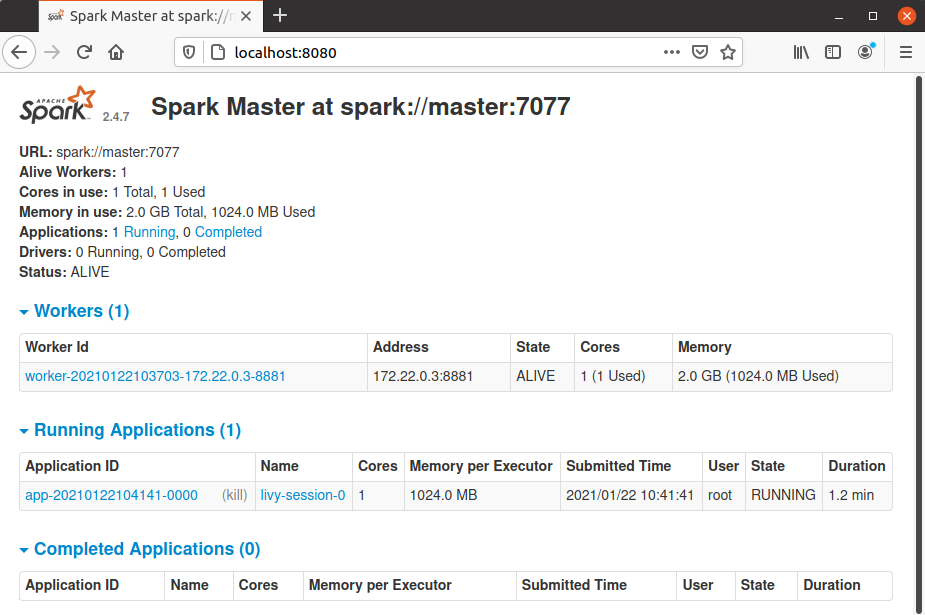

<h1 align="center">
  <h4 align="center">Ansible Spark Livy</h4>
</h1>

<p align="center">
       <a href="">
           
         </a>
    </p>

## Summary

This repository contains a simple ansible playbook to install a **Spark Standalone cluster and Livy in docker**

## Requirements

|Package|Version|  
|:-----:|:-----:|  
|python3|3.8.5|  
|Ansible|2.9.6|

## How to run

```sh
renien@renien-VirtualBox:~/projects/personal/ansible-spark-livy/playbooks$ ansible-playbook --inventory host.inv application_playbook.yml --connection=local

PLAY [local_host] *************************************************************************************************************

TASK [Gathering Facts] ********************************************************************************************************
ok: [127.0.0.1]

TASK [docker : Install dependencies] ******************************************************************************************
changed: [127.0.0.1]

TASK [docker : add key] *******************************************************************************************************
[WARNING]: Consider using the get_url or uri module rather than running 'curl'.  If you need to use command because get_url or
uri is insufficient you can add 'warn: false' to this command task or set 'command_warnings=False' in ansible.cfg to get rid
of this message.
changed: [127.0.0.1]

TASK [docker : add repository] ************************************************************************************************
changed: [127.0.0.1]

TASK [docker : Install docker] ************************************************************************************************
ok: [127.0.0.1]

TASK [docker : Install docker-compose] ****************************************************************************************
changed: [127.0.0.1]

TASK [docker : setup log rotation] ********************************************************************************************
changed: [127.0.0.1]

TASK [docker-livy-spark : check docker-compose version] ***********************************************************************
changed: [127.0.0.1]

TASK [docker-livy-spark : debug docker_compose_version] ***********************************************************************
ok: [127.0.0.1] => {
"docker_compose_version": {
"changed": true,
"cmd": "docker-compose --version",
"delta": "0:00:00.427471",
"end": "2021-01-22 16:02:08.287592",
"failed": false,
"rc": 0,
"start": "2021-01-22 16:02:07.860121",
"stderr": "",
"stderr_lines": [],
"stdout": "docker-compose version 1.27.4, build 40524192",
"stdout_lines": [
"docker-compose version 1.27.4, build 40524192"
]
}
}

TASK [docker-livy-spark : Find out playbook's path] ***************************************************************************
changed: [127.0.0.1]

TASK [docker-livy-spark : debug] **********************************************************************************************
ok: [127.0.0.1] => {
"msg": "'/home/renien/projects/personal/ansible-spark-livy/playbooks' is the playbook directory"
}

TASK [docker-livy-spark : copy the docker folder spark-image/docker-livy-spark] ***********************************************
changed: [127.0.0.1]

TASK [docker-livy-spark : Run docker-compose up] ******************************************************************************
changed: [127.0.0.1]

PLAY RECAP ********************************************************************************************************************
127.0.0.1                  : ok=13   changed=9    unreachable=0    failed=0    skipped=0    rescued=0    ignored=0

```

### Check the running containers 

```shell
root@renien-VirtualBox:~/spark-image/docker-livy-spark# docker-compose ps
     Name                   Command               State                                                            Ports                                                          
----------------------------------------------------------------------------------------------------------------------------------------------------------------------------------
livy             /bin/sh -c ./entrypoint.sh ...   Up      0.0.0.0:4040->4040/tcp, 0.0.0.0:8998->8998/tcp                                                                          
spark-master     bin/spark-class org.apache ...   Up      0.0.0.0:6066->6066/tcp, 7001/tcp, 7002/tcp, 7003/tcp, 7004/tcp, 7005/tcp, 0.0.0.0:7077->7077/tcp, 0.0.0.0:8080->8080/tcp
spark-worker-1   bin/spark-class org.apache ...   Up      7012/tcp, 7013/tcp, 7014/tcp, 7015/tcp, 0.0.0.0:8081->8081/tcp, 8881/tcp
```

### Test Spark and Livy

#### Livy
```shell
# Create a spark session using livy
curl -X POST --data '{"kind": "spark"}' -H "Content-Type: application/json" localhost:8998/sessions

# Test a simple login in spark session
curl localhost:8998/sessions/0/statements -X POST -H 'Content-Type: application/json' -d '{"code":"2 + 2"}'
```

##### Livy & Spark UI





#### Spark-Shell

```shell
renien@renien-VirtualBox:~$ sudo docker exec -it spark-master /bin/bash
root@master:/usr/spark-2.4.7# spark-shell
2021-01-22 10:52:05,836 WARN util.NativeCodeLoader: Unable to load native-hadoop library for your platform... using builtin-java classes where applicable
Setting default log level to "WARN".
To adjust logging level use sc.setLogLevel(newLevel). For SparkR, use setLogLevel(newLevel).
Spark context Web UI available at http://localhost:4040
Spark context available as 'sc' (master = spark://master:7077, app id = app-20210122105212-0001).
Spark session available as 'spark'.
Welcome to
      ____              __
     / __/__  ___ _____/ /__
    _\ \/ _ \/ _ `/ __/  '_/
   /___/ .__/\_,_/_/ /_/\_\   version 2.4.7
      /_/
         
Using Scala version 2.11.12 (Java HotSpot(TM) 64-Bit Server VM, Java 1.8.0_271)
Type in expressions to have them evaluated.
Type :help for more information.

scala> 2 + 2
res0: Int = 4

scala> 

```

## License
[Ansible Spark Livy](https://github.com/Renien/ansible-spark-livy) is released under the [MIT](https://opensource.org/licenses/MIT) © [Renien](https://github.com/Renien).